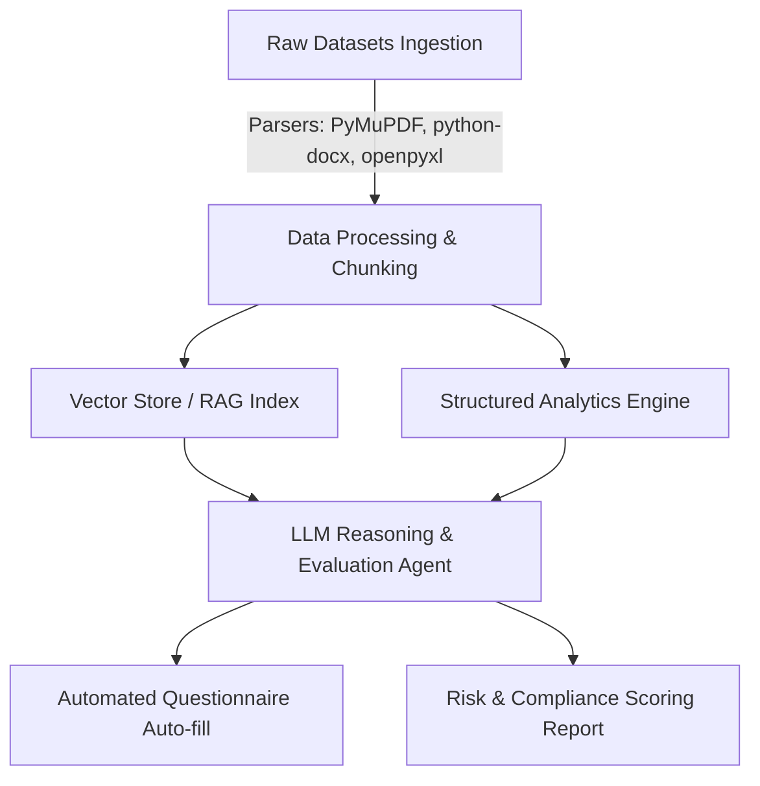

# AI x Finance — Wall Street Hackathon Project Plan

## Executive Summary
This project aims to build an AI-powered automated Vendor Risk Assessment & Financial/Security Compliance Platform tailored for Wall Street financial institutions and enterprise vendor evaluations.

---

## 🎯 Core Objectives
1. **Automated Vendor Security Questionnaire Analysis**: Ingest and auto-evaluate vendor security questionnaires (`.xlsx`) against company security policies.
2. **Policy & Compliance RAG Engine**: Index company policies, SOC2 reports, VAPT reports, and MSA contracts (`.docx`, `.pdf`) for intelligent semantic query answering and auditing.
3. **Infrastructure & Asset Risk Scoring**: Parse asset inventories and access review records to flag security gaps or compliance non-conformities.
4. **Actionable Executive Risk Reports**: Generate structured risk scores, vendor gap analyses, and compliance summary dashboards.

---

## 🛠️ System Architecture & Workflow

---

## 📂 Dataset Integration Strategy

| Category | Datasets | Targeted Processing |
| :--- | :--- | :--- |
| **Vendor Questionnaires** | `datasets/1. Sample_Vendor questionnaire/` | Automated answer extraction, policy mapping & gap verification |
| **Company Policies** | `datasets/2. Company policies/` (13 Policies) | Base truth policy RAG embeddings for compliance benchmarking |
| **Security Reports** | `datasets/3. Security Assessment Reports/` | SOC2 Type II & VAPT report parsing for vulnerability extraction |
| **Contracts & MSAs** | `datasets/4. Contracts_agreements/` | Contract clause analysis & legal requirement mapping |
| **Infrastructure & Logs** | `datasets/5. Infrastructure_internal info/` | Asset inventory parsing, BCP/DR evaluation, network diagram extraction |

---

## 🚀 Implementation Roadmap

### Phase 1: Ingestion & Document Processing
- [ ] Implement document parsers for `.docx`, `.pdf`, and `.xlsx` files in `datasets/`.
- [ ] Implement chunking strategy for complex regulatory & security policy text.
- [ ] Setup vector database (e.g., Chroma / FAISS / Qdrant) for policy embeddings.

### Phase 2: Core AI / RAG Logic
- [ ] Build RAG pipeline for retrieval against the 13 company policy documents.
- [ ] Implement Automated Questionnaire Response Evaluator (matching vendor answers to internal security policies).
- [ ] Develop Risk Scoring Model (high/medium/low risk categorization per domain).

### Phase 3: Application Interface & Reporting
- [ ] Build API endpoints (FastAPI / Flask) in `src/app/main.py`.
- [ ] Create interactive dashboard / CLI report generator.
- [ ] Add export capabilities for audit reports (PDF / JSON / Markdown).

### Phase 4: Testing & Evaluation
- [ ] Write unit tests for document extractors and chunking logic.
- [ ] Perform validation against sample vendor questionnaires (`Regodit`).
- [ ] Benchmark response accuracy and risk scoring consistency.

---

## 📊 Success Metrics
- **Questionnaire Auto-fill Accuracy**: > 85% match with verified compliance policy answers.
- **Processing Time**: < 30 seconds for full vendor questionnaire evaluation.
- **Auditability**: 100% citation coverage linking risk scores back to specific policy source documents.
